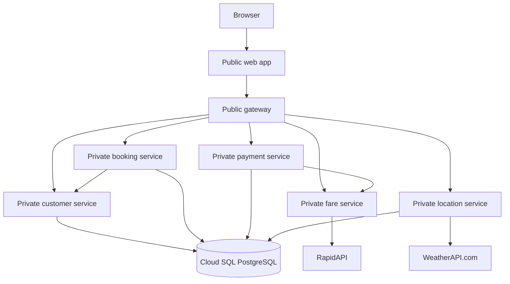
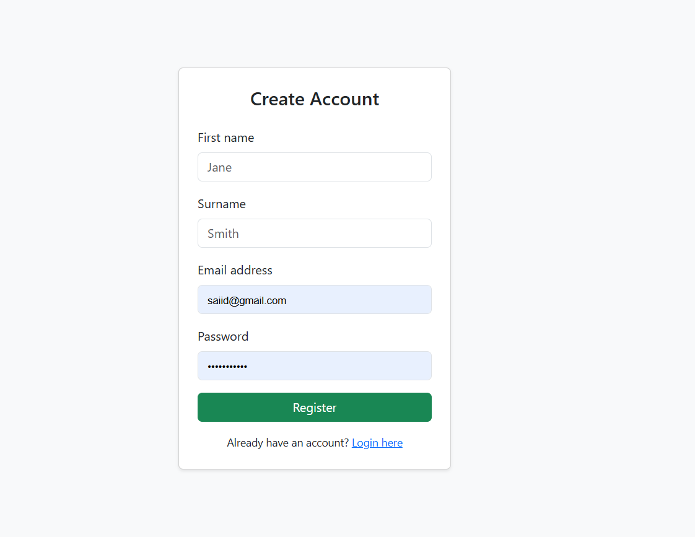
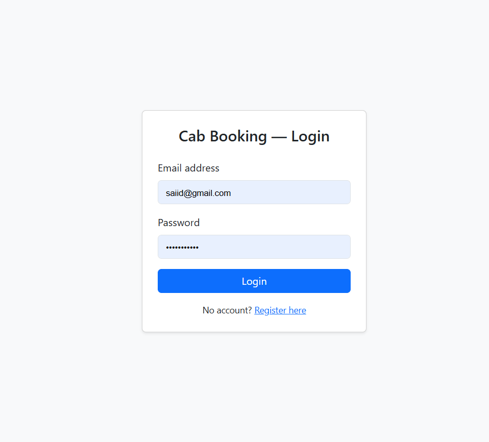
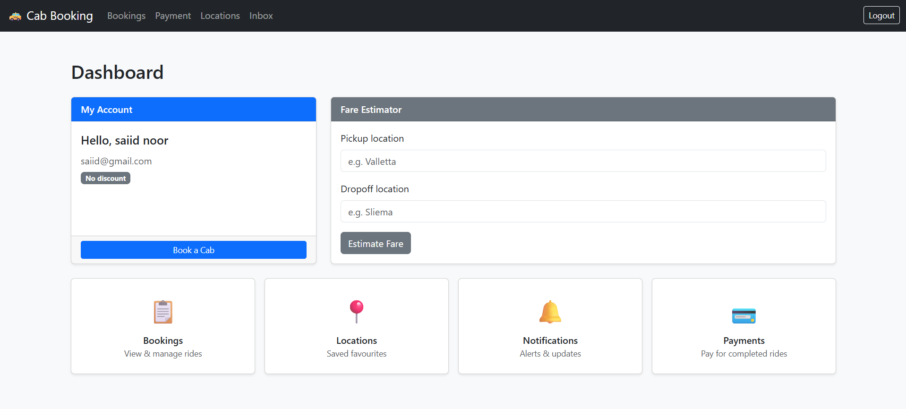
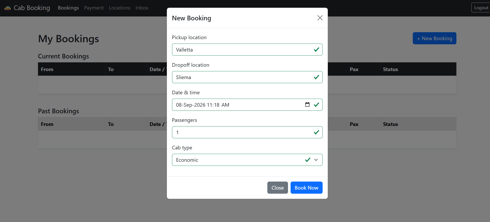
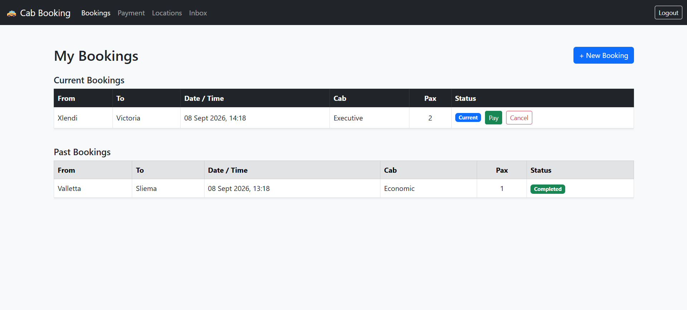
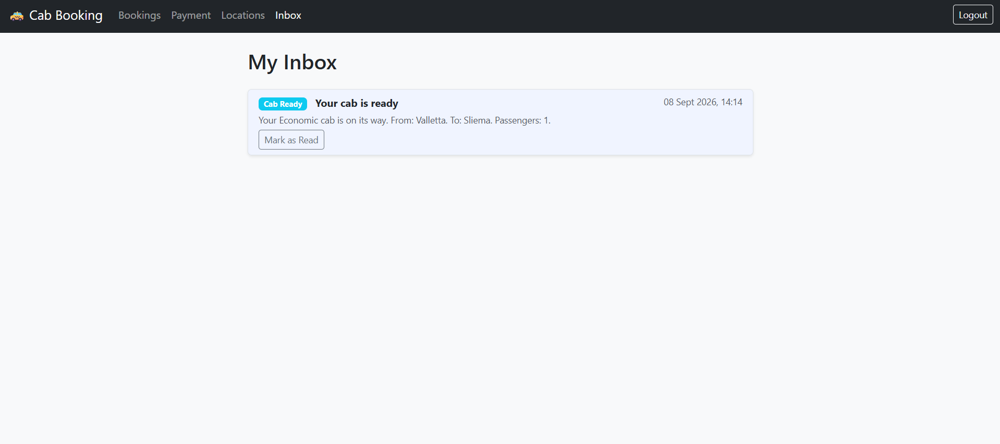
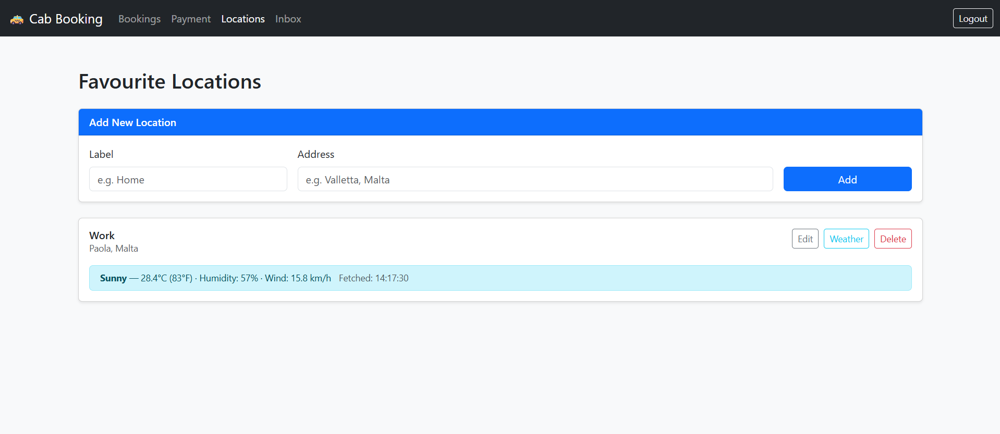
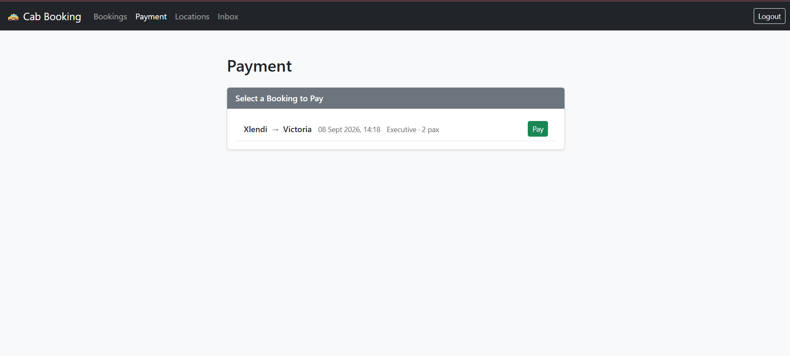

# Cab Booking Platform

A microservices-based cab booking application. Users can create an account, book and pay for rides, manage favourite locations, check the weather, and receive automated notifications. The browser communicates with the backend only through the Gateway API.

## Features

- Registration, login, account details, and a notification inbox
- Current and past bookings with cancellation and completion flows
- External fare estimates and multiplier-based payment calculations
- Favourite-location CRUD with WeatherAPI.com forecasts
- Cab-ready and one-time discount notifications using booking events
- A Bootstrap and Vanilla JavaScript frontend that uses the Fetch API

## Architecture



The web app runs in the browser and sends API requests directly to the Gateway. The web server serves the frontend files.

## Components

| Component                                                            | Local port | Responsibility                                                |
| -------------------------------------------------------------------- | ---------: | ------------------------------------------------------------- |
| [Gateway Service](services/gateway-service/README.md)                 |       4000 | Authentication at the entry point and request forwarding      |
| [Customer Service](services/customer-service/README.md)               |       3001 | Accounts, login, and notifications                            |
| [Booking Service](services/booking-service/README.md)                 |       3002 | Booking lifecycle and booking events                          |
| [Payment Service](services/payment-service/README.md)                 |       3003 | Fare multipliers, payments, and stored calculation breakdowns |
| [Fare Estimation Service](services/fare-estimation-service/README.md) |       3004 | External fare estimates                                       |
| [Location Service](services/location-service/README.md)               |       3005 | Favourite locations and weather forecasts                     |
| [Web App](web-app/README.md)                                          |       8080 | Displays the user interface and handles browser interactions  |

## Technology

| Area                    | Technology                                          |
| ----------------------- | --------------------------------------------------- |
| Runtime and packages    | Node.js, npm                                        |
| Backend API             | Express.js, Axios,`cors`, `dotenv`              |
| Authentication          | `jsonwebtoken` (JWT), `bcrypt`                  |
| Database                | PostgreSQL,`pg`, JSONB, Google Cloud SQL          |
| Event-driven processing | Node.js`EventEmitter`, `setTimeout`             |
| Frontend                | HTML5, Bootstrap 5.3, Vanilla JavaScript, Fetch API |
| Development tooling     | `nodemon`                                         |
| External APIs           | RapidAPI Taxi Fare Calculator, WeatherAPI.com       |
| Testing                 | Postman, Newman, PowerShell runner scripts          |

## Deployment

Seven Docker containers run on Google Cloud Run with a shared Cloud SQL PostgreSQL database.

### Deployment technology

| Technology        | Purpose                                          |
| ----------------- | ------------------------------------------------ |
| Docker            | Container packaging                              |
| Cloud Run         | Service hosting                                  |
| Cloud Build       | Container image builds                           |
| Artifact Registry | Image storage                                    |
| Cloud SQL         | PostgreSQL hosting                               |
| Secret Manager    | Credentials and API keys                         |
| IAM               | Cloud resource access and service authentication |

### Hosting configuration

| Setting             | Value                                            |
| ------------------- | ------------------------------------------------ |
| Region              | `europe-west10`                                |
| Cloud Run           | First generation; 1 vCPU, 256 MiB per service    |
| Scaling             | 0–1 instances per service                       |
| Requests            | Concurrency 20; timeout 60 seconds; port`8080` |
| Database            | PostgreSQL 18.x, Cloud SQL Enterprise            |
| Database capacity   | 1 vCPU, 3.75 GiB memory, 60 GB SSD, single zone  |
| Database protection | Deletion protection enabled                      |

### Build and deployment

[Cloud Run source deployment](https://cloud.google.com/run/docs/deploying-source-code) uses `gcloud run deploy --source` and each service's Dockerfile. Cloud Build produces the images; Artifact Registry stores them.

The `cab-booking-web` service is built from `web-app/`. Backend services are built from `services/<service-name>/`. Docker Compose is not used.

### Deployment configuration

Cloud Run supplies `PORT`; all services use `NODE_ENV=production`. Service addresses and credentials are configured outside the source code.

#### Database connection modes

| Variable                     | Purpose                                                            |
| ---------------------------- | ------------------------------------------------------------------ |
| `INSTANCE_CONNECTION_NAME` | Cloud SQL Unix socket connection                                   |
| `DB_NAME`, `DB_USER`     | Database name and login                                            |
| `DB_PASSWORD`              | Database password from Secret Manager                              |
| `DATABASE_URL`             | Direct connection when socket mode is absent                       |
| `DB_SSL`                   | Direct-mode TLS when`true`; certificate verification is disabled |

Socket mode takes precedence over `DATABASE_URL`. Each client uses a five-connection pool with a 30-second idle timeout. Cloud Run exposes the socket through its [Cloud SQL integration](https://cloud.google.com/sql/docs/postgres/connect-run).

#### Environment bindings

| Service         | Variables                                                                                                                  |
| --------------- | -------------------------------------------------------------------------------------------------------------------------- |
| Gateway         | `CUSTOMER_SERVICE_URL`, `BOOKING_SERVICE_URL`, `PAYMENT_SERVICE_URL`, `FARE_SERVICE_URL`, `LOCATION_SERVICE_URL` |
| Booking         | `CUSTOMER_SERVICE_URL`                                                                                                   |
| Payment         | `FARE_SERVICE_URL`                                                                                                       |
| Fare Estimation | `FARE_API_URL`, `FARE_API_HOST`, `FARE_API_TIMEOUT_MS`                                                               |
| Location        | `WEATHER_API_BASE_URL`                                                                                                   |
| Web             | `GATEWAY_URL`                                                                                                            |

Service URL variables point to Cloud Run HTTPS endpoints. The web server exposes `GATEWAY_URL` through a generated `/js/config.js` response with caching disabled.

#### Secret bindings

| Variable            | Services                                      |
| ------------------- | --------------------------------------------- |
| `DB_PASSWORD`     | Customer, Booking, Payment, Location          |
| `JWT_SECRET`      | Gateway, Customer, Booking, Payment, Location |
| `FARE_API_KEY`    | Fare Estimation                               |
| `WEATHER_API_KEY` | Location                                      |

[Secret Manager values](https://cloud.google.com/run/docs/configuring/services/secrets) are injected as environment variables at startup.

### Identity and access

Web and Gateway are public; backend services require Cloud Run IAM authentication. Protected API routes also require a user JWT.

### Deployment limitations

- In-memory notification timers can be lost on restart or delayed by CPU throttling.
- The shared runtime identity grants broader permissions than individual services need.
- Single-zone SQL has no regional failover; low instance limits restrict throughput.
- Dockerfiles use Node 20, but the locked `google-auth-library@11.0.2` in Gateway, Booking, and Payment requires Node 22 or later.
- Infrastructure and database migrations are not automated in the repository.

## Local Setup

Use Node.js 22 or later for the locked Google authentication dependency. The container/runtime mismatch is documented in [deployment limitations](#deployment-limitations).

Prerequisites are npm, access to the application PostgreSQL schema, the subscribed fare API, and WeatherAPI.com credentials.

### Configuration

Copy each backend service's `.env.example` to `.env`. 

### Installation

From the repository root in PowerShell:

```powershell
Get-ChildItem .\services -Directory | ForEach-Object {
  npm.cmd --prefix $_.FullName ci
  if ($LASTEXITCODE -ne 0) { throw "Dependency installation failed." }
}
npm.cmd --prefix .\web-app ci
```

### Startup

Run each command in a separate terminal. 

```powershell
cd services/customer-service
npm run dev
```

Repeat from the repository root for `booking-service`, `fare-estimation-service`, `payment-service`, `location-service`, and `gateway-service`.

Start the frontend from the repository root in another terminal:

```powershell
$env:GATEWAY_URL = "http://localhost:4000"
npm.cmd --prefix .\web-app start
```

Open `http://localhost:8080`

### Health

```powershell
Invoke-RestMethod http://localhost:4000/health
Invoke-RestMethod http://localhost:8080/health
```

These confirm the Gateway and web HTTP processes respond.

## Testing

[Postman and Newman](postman/README.md) describes API collection coverage and local test execution. [Browser acceptance](web-app/README.md#manual-browser-testing) describes the UI checks.

## Project Documentation

| Document                                   | Content                                                                               |
| ------------------------------------------ | ------------------------------------------------------------------------------------- |
| This README                                | Architecture, deployment, component directory, local setup                            |
| Component READMEs                          | API contracts, validation, persistence responsibilities, service-specific limitations |
| [Web App](web-app/README.md)                | Browser pages, session behavior, UI validation and acceptance                         |
| [Postman](postman/README.md)                | API collections and test execution                                                    |
| [Container documentation](docker/README.md) | Container source locations and Compose status                                         |

## Screenshots
















